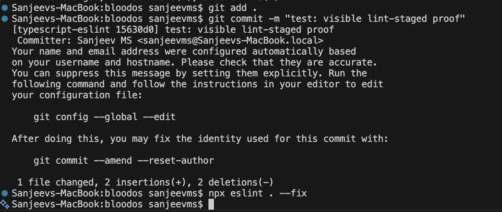
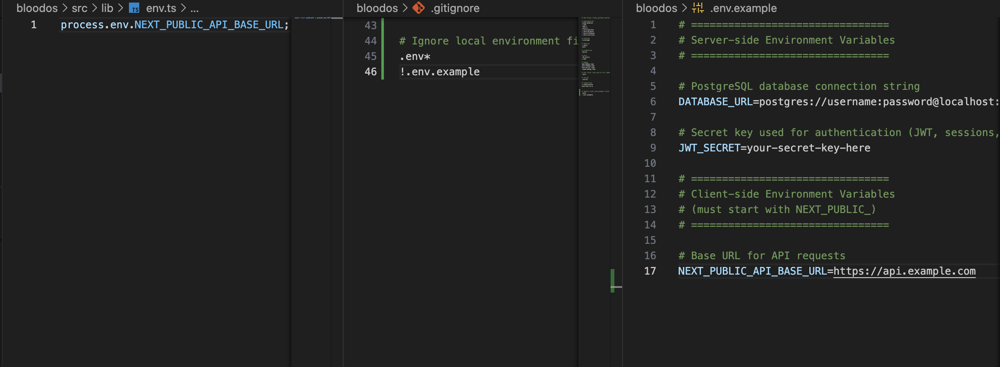

# 🩸 BloodOS – Real-Time Blood Donation & Inventory Management Platform

## 📌 Project Overview

India’s blood banks and hospitals often face shortages not due to lack of donors, but because of poor coordination and outdated inventory tracking systems. During emergencies, delays in finding available blood units can cost lives.

**BloodOS** is a real-time full-stack web platform designed to bridge this gap by connecting:
- Blood donors
- Hospitals / blood banks
- NGOs / administrators

The platform enables live inventory tracking, location-based search, and secure role-based access to ensure timely availability of critical blood resources.

---

## 📂 Folder Structure

```
src/
├── app/          # Routes, pages, layouts, and API routes using Next.js App Router
├── components/   # Reusable UI components such as Navbar, Footer, and shared UI elements
├── lib/          # Utility functions, helpers, and configuration files
```

### Folder Purpose
- **app/**: Handles routing, page rendering, layouts, and backend API routes in a full-stack manner.
- **components/**: Stores reusable UI components to ensure consistency and reduce duplication.
- **lib/**: Centralizes shared logic, utilities, and configurations to keep the codebase clean and maintainable.

This separation of concerns helps the application scale smoothly as new features are added.

---

## ⚙️ Setup Instructions

Follow the steps below to run the project locally:

1. Clone the repository:
   ```
   git clone <repository-url>
   ```

2. Navigate to the project directory:
   ```
   cd bloodos
   ```

3. Install dependencies:
   ```
   npm install
   ```

4. Start the development server:
   ```
   npm run dev
   ```

5. Open your browser and visit:
   ```
   http://localhost:3000
   ```

---

## 🧠 Reflection

This folder structure was chosen to clearly separate routing logic, reusable UI components, and shared utilities. By organizing the project this way, team members can work in parallel without conflicts, onboard new developers faster, and add features more efficiently in future sprints. As the application grows, this structure will help maintain readability, reduce technical debt, and keep the codebase scalable and clean.

---

## 🖥️ Local Development Screenshot

> 📸 Screenshot of the application running locally on `http://localhost:3000`:


---

## 🧱 Tech Stack

| Layer | Technology |
|------|-----------|
| Frontend | Next.js (TypeScript) |
| Backend API | Next.js API Routes |
| Styling | Tailwind CSS |
| Tooling | ESLint |
| Cloud (Planned) | AWS / Azure |

---


## 🧹 TypeScript & ESLint Configuration (Sprint 1 – Assignment 2.9)

### Strict TypeScript Configuration
Strict TypeScript mode has been enabled in `tsconfig.json` to improve code safety and catch potential bugs early during development. The following rules are enforced:
- `strict`: Enables all strict type-checking options
- `noImplicitAny`: Prevents variables from having an implicit `any` type
- `noUnusedLocals`: Flags unused local variables
- `noUnusedParameters`: Flags unused function parameters
- `forceConsistentCasingInFileNames`: Avoids file path casing issues across operating systems
- `skipLibCheck`: Skips type checking of declaration files for faster builds

These settings help reduce runtime errors and improve long-term maintainability.

### ESLint & Prettier
ESLint and Prettier are configured together to enforce consistent coding standards and formatting across the project:
- ESLint enforces rules such as consistent quotes, mandatory semicolons, and controlled console usage
- Prettier handles automatic code formatting to maintain uniform style across the team
- `eslint-config-prettier` is used to avoid conflicts between ESLint and Prettier rules

### Pre-Commit Hooks (Husky + lint-staged)
Pre-commit hooks were set up using Husky and lint-staged to ensure code quality before changes are committed:
- ESLint automatically fixes lint issues on staged files
- Prettier formats code before commits
- Commits fail if linting or formatting errors remain

This ensures that only clean, consistent, and high-quality code is committed to the repository, improving collaboration and reducing review overhead.

### 🧪 Linting & Pre-Commit Enforcement Evidence

The following screenshot shows ESLint running successfully in the project, validating that linting rules are correctly configured and enforced as part of the development workflow. With modern ESLint (v9) and flat configuration, linting may run silently when no blocking errors are present.




---

## 🔐 Environment Variable Management (Sprint 1 – Assignment 2.10)

This project uses environment variables to manage sensitive configuration securely and follow best practices for production-ready applications.

### Environment Files

- **`.env.local`**: Use this file for **local development secrets**. It is **ignored by Git** and should never be committed. It overrides defaults for your local machine.
- **`.env.example`**: A **committed template file**. It lists all required environment variables with placeholder values and comments to guide new developers.

### Type of Variables

#### 1. Server-Side Variables (Secrets)
These variables are available **only on the server** (e.g., API routes, server components, `getServerSideProps`). They are **never exposed** to the client-side bundle.

- `DATABASE_URL`: Connection string for the PostgreSQL database.
- `JWT_SECRET`: Secret key used for signing authentication tokens.

**Usage:**
```ts
// Server-side only
const dbUrl = process.env.DATABASE_URL;
const secret = process.env.JWT_SECRET;
```

#### 2. Client-Side Variables (Public)
Variables prefixed with `NEXT_PUBLIC_` are automatically exposed to the browser. Use these **strictly** for non-sensitive data (e.g., API endpoints, public keys).

- `NEXT_PUBLIC_API_BASE_URL`: The base URL for the backend API.

**Usage:**
We use a centralized helper file for client-side variables to ensure type safety and consistency.

```ts
// src/lib/env.ts
export const apiBaseUrl = process.env.NEXT_PUBLIC_API_BASE_URL;
```

### 🚀 Setup Instructions

1. **Copy the example file:**
   Duplicate `.env.example` to create your local environment file.
   ```bash
   cp .env.example .env.local
   ```

2. **Configure your secrets:**
   Open `.env.local` and fill in your actual credentials (database URL, secrets, etc.).

3. **Restart the server:**
   Next.js loads environment variables on startup. Restart your dev server to apply changes.
   ```bash
   npm run dev
   ```

### 🛡️ Security Considerations

- **Never commit `.env.local`**: It is explicitly ignored in `.gitignore`.
- **Prefix carefully**: Only use `NEXT_PUBLIC_` for variables that are safe to be public.
- **Access control**: Server-side variables like `DATABASE_URL` will be `undefined` if accessed in client-side code, preventing accidental leaks.

### ❌ Common Mistakes Avoided

- **Committing secrets**: Ensure `.env.local` is always in `.gitignore`.
- **Exposing secrets to client**: Avoid adding `NEXT_PUBLIC_` to sensitive keys like `JWT_SECRET`.
- **Hardcoding values**: Always use `process.env` instead of hardcoding URLs or keys.
- **Missing production variables**: Ensure all variables in `.env.example` are also set in your production environment (e.g., Vercel, AWS).

### 📸 Environment Configuration Evidence

The screenshots below demonstrate correct environment variable setup and safe usage within the project:

- `.env.example` documenting required server-side and client-side variables
- `.gitignore` ensuring `.env.local` is never committed
- Centralized and safe access of environment variables using `process.env`




---

## 🛡️ Input Validation & Zod (Sprint 1 – Assignment 2.19)

We use **Zod** to validate all incoming API requests. This ensures data integrity and provides helpful error messages to the frontend before any database operations occur.

### 1️⃣ Schema Shared Library

We define reusable schemas in `src/lib/schemas/` that can be inferred as TypeScript types:

**Example: UserSchema (`src/lib/schemas/userSchema.ts`)**
```typescript
export const UserSchema = z.object({
  email: z.string().email(),
  password: z.string().min(8),
  role: z.enum(['DONOR', 'HOSPITAL', 'ADMIN'])
});

export type UserInput = z.infer<typeof UserSchema>;
```

### 2️⃣ Validation Workflow

In our API routes (e.g., `POST /api/users`), we use `safeParse`:

1.  **Parse Body**: `UserSchema.safeParse(body)`
2.  **Check Success**: If `!result.success`, return 400 immediately.
3.  **Format Errors**: Map Zod errors to a clean `{ field, message }` array.

### 3️⃣ Example Responses

#### ✅ Success
`POST /api/users`
```json
{
  "success": true,
  "message": "User created successfully",
  "data": { "id": "uuid-123", "email": "test@example.com" }
}
```

#### ❌ Validation Error
`POST /api/users` (Invalid email and short password)
```json
{
  "success": false,
  "message": "Validation Error",
  "error": {
    "code": "E100",
    "details": [
      { "field": "email", "message": "Invalid email address" },
      { "field": "password", "message": "String must contain at least 8 character(s)" }
    ]
  },
  "timestamp": "..."
}
```

### 🧠 Reflection

-   **Reusability**: By exporting `type UserInput = z.infer<...>`, our frontend form components can use the *exact same* type definition as the backend validation logic.
-   **Security**: Validation happens *before* checking the database, preventing unnecessary queries and potential injection attacks.
-   **Clarity**: Structured error messages help frontend developers highlight specific form fields that need correction.

---

## 🔐 Authentication APIs & JWT (Sprint 1 – Assignment 2.20)

We implemented a stateless authentication system using **JSON Web Tokens (JWT)** and **bcrypt** for secure password hashing.

### 1️⃣ Auth Flow

1.  **Signup (`POST /api/auth/signup`)**:
    -   Validates input with Zod.
    -   Hashes password with `bcrypt.hash(password, 10)`.
    -   Creates user in DB.
2.  **Login (`POST /api/auth/login`)**:
    -   Verifies credentials.
    -   Generates a signed JWT (`expiresIn: 1h`).
    -   Returns token to client.
3.  **Protected Routes**:
    -   Endpoints like `GET /api/users` now require an `Authorization: Bearer <token>` header.
    -   The server verifies the token signature before processing the request.

### 2️⃣ Security Implementation

-   **Password Storage**: We *never* store plain-text passwords. Only salted hashes.
-   **Secrets**: The JWT signature relies on `JWT_SECRET` (in `.env.local`), ensuring tokens cannot be forged.
-   **Error Handling**: Login failures return generic "Invalid credentials" messages to prevent user enumeration.

### 3️⃣ Usage Examples

#### Signup
```bash
curl -X POST http://localhost:3000/api/auth/signup \
  -H "Content-Type: application/json" \
  -d '{"email":"nurse@hospital.com", "password":"securePassword123", "role":"HOSPITAL"}'
```

#### Login
```bash
curl -X POST http://localhost:3000/api/auth/login \
  -H "Content-Type: application/json" \
  -d '{"email":"nurse@hospital.com", "password":"securePassword123"}'
```
**Response:**
```json
{
  "success": true,
  "data": {
    "token": "eyJhGciOiJIUzI1...",
    "user": { "id": "...", "role": "HOSPITAL" }
  }
}
```

#### Access Protected Route
```bash
curl -H "Authorization: Bearer <YOUR_TOKEN>" http://localhost:3000/api/users
```

### 🧠 Reflection

-   **Statelessness**: Using JWT allows our API to scale horizontally without needing a central session store (like Redis) for basic auth.
-   **Role-Based Access**: The token payload includes the user's `role`, allowing us (in future sprints) to easily restrict certain actions to ADMINs or HOSPITALs only.

---

## 🤝 Team Branching & PR Workflow (Sprint 1 – Assignment 2.11)

This project follows a professional Git workflow designed to enhance collaboration, code quality, and traceability. Every change goes through a strict process of branching, pull request (PR) review, and automated checks before merging into the main codebase.

### 1️⃣ Branch Naming Convention

We strictly follow a structured naming convention to easily identify the purpose of each branch.

**Format:** `type/short-description`

| Type | Description | Example Branch Name |
|------|-------------|---------------------|
| **feature** | New features or enhancements | `feature/login-auth`, `feature/hospital-dashboard` |
| **fix** | Bug fixes or patches | `fix/navbar-alignment` |
| **chore** | Maintenance, tooling, or refactoring | `chore/workflow-setup` |
| **docs** | Documentation updates | `docs/update-readme` |

**Why this improves collaboration:**
- Clearly communicates intent before opening the code.
- Groups related changes logically.
- Helps with automated release notes and changelogs.

---

### 2️⃣ Pull Request (PR) Template

To maintain high standards, we use a mandatory **Pull Request Template** located at `.github/pull_request_template.md`. This ensures every PR description includes:

- **Summary**: Context on what was done and why.
- **Changes Made**: Bullet points of specific technical changes.
- **Screenshots / Evidence**: Visual proof of the changes (UI or logs).
- **Checklist**: Confirmation of local testing, linting, and no secret exposure.

This standardization speeds up reviews by providing reviewers with all necessary context upfront.

---

### 3️⃣ Code Review Checklist

Reviewers must verify the following before approving a PR:

- [ ] **Folder Structure**: Code is placed in the correct `app`, `components`, or `lib` directory.
- [ ] **Naming Conventions**: Variables and functions use meaningful names (camelCase for TS, PascalCase for components).
- [ ] **No Console Errors**: The browser console is clean during runtime.
- [ ] **Lint & Formatting**: `npm run lint` passes without warnings.
- [ ] **Environment Variables**: No hardcoded secrets; use `process.env` via `src/lib/env.ts`.
- [ ] **Type Safety**: No `any` types; interfaces are defined properly.
- [ ] **Documentation**: Comments explain complex logic; README is updated if improved.

---

### 4️⃣ Branch Protection Rules

To prevent broken code from reaching production, the following rules are configured for the `main` branch:

1.  **Require Pull Request reviews before merging**:
    - At least **one approval** is required from a teammate.
    - Prevents unreviewed code from being merged.

2.  **Require status checks to pass before merging**:
    - Build and Lint checks must succeed.
    - Ensures the codebase remains deployable at all times.

3.  **Include administrators in restrictions**:
    - Even admins cannot bypass these rules, ensuring consistency.

4.  **Do not allow bypassing the above settings**:
    - Enforces the workflow for everyone on the team.

---

### 🧠 Reflection

Implementing this workflow shifts the development process from "coding alone" to "engineering together."
- **Velocity**: It initially slows down individual commits but **speeds up the overall release cycle** by catching bugs early.
- **Quality**: Mandatory reviews and checklists drastically reduce the chance of bad code reaching production.
- **Traceability**: Structured branch names and PR templates created a clear history of *why* changes were made, not just *what* changed.

---


---

## 🐳 Docker & Compose Setup (Sprint 1 – Assignment 2.12)

This project is fully containerized using **Docker** and **Docker Compose**, providing a consistent development environment across all team members' machines. This eliminates "it works on my machine" issues and simplifies dependency management.

### 1️⃣ Dockerfile Overview

We use a multi-stage `Dockerfile` optimized for production performance:

- **Base Stage**: Installs dependencies on a lightweight `node:20-alpine` image.
- **Builder Stage**: Compiles the Next.js application.
- **Runner Stage**: Creates a minimal production image, running the app in "standalone" mode to reduce image size significantly (from >1GB to ~100MB).

### 2️⃣ Docker Compose Services

Our `docker-compose.yml` orchestrates the following services:

| Service | Image | Internal Port | External Port | Description |
|---------|-------|---------------|---------------|-------------|
| **app** | `node:20-alpine` | `3000` | `3000` | The core Next.js application. |
| **db** | `postgres:15-alpine` | `5432` | `5432` | Primary database with persistent volume `pgdata`. |
| **redis** | `redis:7-alpine` | `6379` | `6379` | In-memory cache for session management and queues. |

### 3️⃣ Setup & Commands

#### Build and Start
To build the images and start all services in the background:
```bash
docker-compose up --build -d
```

#### Check Status
To verify all containers are running correctly:
```bash
docker ps
```
You should see `bloodos_app`, `bloodos_db`, and `bloodos_redis` actively running.

#### Stop Services
To stop and remove containers (data in volumes persists):
```bash
docker-compose down
```

#### View Logs
To follow logs for the application:
```bash
docker-compose logs -f app
```

### 4️⃣ Troubleshooting & Tips

- **Port Conflicts**: Ensure ports `3000`, `5432`, and `6379` are not being used by local instances of Node, Postgres, or Redis.
- **Permissions**: If build fails on Linux/Mac, ensure you have proper Docker permissions (`sudo` might be needed).
- **Environment**: The `docker-compose.yml` sets default development variables. For production, these should be securely injected via a `.env` file on the server.

### 5️⃣ 📸 Submission Screenshots

For Assignment 2.12, capture the following evidence:
1.  **Build Logs**: Screenshot of the terminal showing a successful `docker-compose up --build`.
2.  **Container Status**: Screenshot of `docker ps` listing all 3 active containers.
3.  **App Running**: Browser screenshot of `localhost:3000`.
4.  **Database Connection**: Screenshot of a DB client (like DBeaver or pgAdmin) connected to `localhost:5432`.

### 🧠 Reflection

Containerization ensures that every developer runs the exact same versions of Node.js, PostgreSQL, and Redis. This drastically reduces onboarding time for new team members and ensures that the production environment behaves exactly like the local development environment.

---


---

## 🏗️ PostgreSQL Schema Design (Sprint 1 – Assignment 2.13)

This project uses **Prisma ORM** with **PostgreSQL** to define a strongly-typed, normalized relative schema. The design prioritizes data integrity, role separation, and query performance.

### 1️⃣ Core Entities & Relationships

| Entity | Description | Key Relationships |
|--------|-------------|-------------------|
| **User** | Central authentication entity. | 1:1 with `DonorProfile` or `HospitalProfile`. |
| **DonorProfile** | Specific data for blood donors. | Belongs to `User`. Logs `DonationRecord`. |
| **HospitalProfile** | specific data for healthcare facilities. | Belongs to `User`. Manages `BloodInventory`. |
| **BloodInventory** | Tracks blood stock levels at hospitals. | N:1 with `HospitalProfile`. Indexed by blood type. |
| **BloodRequest** | Requests for blood from hospitals/users. | N:1 with `User` (Requester). |
| **DonationRecord** | History of completed donations. | N:1 with `DonorProfile` (User). |

### 2️⃣ Normalization Strategy

We strictly adhere to **3NF (Third Normal Form)** to eliminate redundancy:

-   **1NF (Atomic Values)**: No arrays or nested objects (e.g., inventory is a separate table, not a JSON field on Hospital).
-   **2NF (No Partial Dependencies)**: All tables have a single primary key (`id`), and all fields depend on the whole key.
-   **3NF (No Transitive Dependencies)**: Address details are stored on profiles, not repeated on every transaction. Blood type is an ENUM, ensuring consistency.

### 3️⃣ Migration & Seeding Commands

#### Initialize & Push Schema
To create the tables in your local PostgreSQL container:
```bash
npx prisma migrate dev --name init_schema
```

#### Generate Client
To update the TypeScript types based on the schema:
```bash
npx prisma generate
```

#### View Data
To inspect the database using a GUI:
```bash
npx prisma studio
```

#### Seed Initial Data
To populate the DB with a test Admin, Hospital, and Donor:
```bash
npx prisma db seed
```

### 4️⃣ Scalability Considerations

-   **Indexes**: Added on frequently queried columns like `bloodType`, `hospitalId`, and `status` to speed up filtering.
-   **Enums**: Used for `Role`, `BloodType`, and `Status` to enforce data integrity at the database level.
-   **UUIDs**: We use UUIDs for primary keys to allow easy data merging and avoid sequential ID enumeration attacks.
-   **Cascade Deletes**: Configuring `onDelete: Cascade` ensures that deleting a User automatically cleans up their Profile and related sensitive data.

### 5️⃣ 📸 Submission Screenshots

For Assignment 2.13, capture:
1.  **Migration Success**: Terminal output showing `prisma migrate dev` completion.
2.  **Prisma Studio**: Screenshot of the browser showing the `User` and `BloodInventory` tables populated with seed data.

---


---

## 🏎️ Prisma ORM Setup & Client Initialisation (Sprint 1 – Assignment 2.14)

Prisma is our chosen ORM (Object-Relational Mapper) because it provides **type-safety**, **auto-completion**, and **migration management** out of the box. This setup ensures that our database interactions are robust and scalable.

### 1️⃣ Installation & Initialization

We installed the core Prisma CLI and the client library:
```bash
npm install prisma --save-dev
npm install @prisma/client
npx prisma init
```
- `prisma`: Development tool for migrations and studio.
- `@prisma/client`: Auto-generated query builder used in our Next.js API routes.
- `prisma.config.ts`: Configuration file (replacing `schema.prisma` datasource URL in v7).

### 2️⃣ Schema Design (Production-Ready)

Our `prisma/schema.prisma` file defines all models (`User`, `DonorProfile`, `BloodInventory`, etc.) with strict types and relationships.
- **Enums** (`UserRole`, `BloodType`) enforce data consistency.
- **Indexes** (`@@index`) optimize query performance.
- **Relations** (`@relation`) link tables (e.g., User -> DonorProfile).

### 3️⃣ Migration Workflow

To apply changes to the database:
1.  **Modify** `schema.prisma`.
2.  **Run Migration**:
    ```bash
    npx prisma migrate dev --name <migration_name>
    ```
    This creates the SQL tables and updates the database.
3.  **Generate Client**:
    ```bash
     npx prisma generate
    ```
    This updates the TypeScript types in `node_modules`.
4.  **Verify**:
    ```bash
    npx prisma studio
    ```
    Opens a web GUI to view/edit data.

### 4️⃣ Prisma Client (Singleton Pattern)

To prevent connection exhaustion in Next.js (especially during hot-reloading in dev), we use a **singleton instance** located at `src/lib/prisma.ts`.

```ts
import { PrismaClient } from '@prisma/client'

const globalForPrisma = globalThis as unknown as { prisma: PrismaClient }

export const prisma = globalForPrisma.prisma || new PrismaClient({
  log: ['query'],
})

if (process.env.NODE_ENV !== 'production') globalForPrisma.prisma = prisma
```

### 5️⃣ Testing the Setup

We created a test API route at `src/app/api/test-db/route.ts` that:
1.  Connects to the database.
2.  Upserts a test user.
3.  Fetches and returns all users.

**Access it at:** `http://localhost:3000/api/test-db`

### 🧠 Reflection

Prisma bridges the gap between our TypeScript application and the PostgreSQL database.
- **Safety**: Creating a user with an invalid role (e.g., "SUPER_ADMIN") throws a compile-time error, preventing bugs before they run.
- **Productivity**: Auto-completion for database queries speeds up development significantly.
- **Maintenance**: Schema migrations are version-controlled, making it easy to roll back or deploy changes safely.

### 📷 Submission Evidence
1.  **Migration Logs**: Terminal screenshot of `npx prisma migrate dev`.
2.  **Prisma Studio**: Screenshot of the browser GUI showing seeded data.
3.  **API Response**: JSON response from `/api/test-db`.

---


---

## 🎲 Database Migrations & Seed Scripts (Sprint 1 – Assignment 2.15)

Managing database schema changes effectively is critical for team collaboration and production stability. We use Prisma Migrations to track changes and Seed Scripts to populate consistent test data.

### 1️⃣ Database Migrations

**Migrations** act as version control for your database schema. They ensure every developer and the production server have the exact same table structure.

#### Creating a Migration
When you modify `prisma/schema.prisma` (e.g., adding a field), run:
```bash
npx prisma migrate dev --name <descriptive-name>
```
*Example: `npx prisma migrate dev --name add_dob_to_user`*
This generates a SQL file in `prisma/migrations` and applies it to your local DB.

#### Deploying to Production
**NEVER** use `migrate dev` in production. Instead, use:
```bash
npx prisma migrate deploy
```
This applies pending migrations without resetting the database or generating new SQL files.

#### Resetting the Database
If your local database gets messy or out of sync:
```bash
npx prisma migrate reset
```
This drops the database, re-applies all migrations, and runs the seed script automatically.

### 2️⃣ Production-Level Strategy

-   **Immutability**: Once a migration is merged to `main`, the SQL file should never be edited. If you made a mistake, create a *new* migration to fix it.
-   **Review**: SQL migration files should be reviewed in PRs to ensure no accidental data loss (e.g., `DROP TABLE`).
-   **Backup**: Always backup the production database before running `migrate deploy`.

### 3️⃣ Seed Script (Idempotent)

Our seed script at `prisma/seed.ts` loads essential initial data (Admin, Hospital, Donor).

-   **Command**: `npx prisma db seed`
-   **Idempotency**: We use `upsert` (Update or Insert) instead of `create`. This allows you to run the seed command multiple times without crashing due to duplicate key errors.

**Configuration in `package.json`**:
```json
"prisma": {
  "seed": "ts-node prisma/seed.ts"
}
```

### 4️⃣ Verification

To verify the schema and data:
1.  Run `npx prisma studio`.
2.  Check the `User` table for the seeded admin and donor.
3.  Check `BloodInventory` for the initial stock.

### 🧠 Reflection

-   **Consistency**: Migrations eliminate "it works on my machine" issues caused by schema drift.
-   **Onboarding**: New developers simply run `npm install` and `npx prisma migrate dev`, and they have a fully working, populated database immediately.
-   **Reliability**: Automated migrations reduce the risk of human error during deployments compared to manual SQL execution.

### 📷 Submission Evidence

1.  **Migration Logs**: Screenshot of `npx prisma migrate dev` success.
2.  **Migration Folder**: Screenshot of the `prisma/migrations` directory structure.
3.  **Seed Output**: Screenshot of the terminal showing "🌱 Starting seed..." and "✅ Created...".
4.  **Prisma Studio**: Screenshot showing the populated data.

---


---

## ⚡ Transaction & Query Optimisation (Sprint 1 – Assignment 2.16)

Efficient database interactions are key to BloodOS's scalability. We use **Prisma Transactions** for data integrity and **Optimised Queries** to reduce load.

### 1️⃣ Atomic Transactions (Rollback Safety)

When a donation is recorded, three things **must** happen together or **none** at all:
1.  **Create** a `DonationRecord`.
2.  **Update** `BloodInventory` (add stock).
3.  **Log** the action in `AuditLog`.

We use `prisma.$transaction` to enforce this. If any step fails (e.g., database error or validation check), the entire operation is rolled back, preventing "phantom" inventory.

**Example Endpoint:** `src/app/api/donation/route.ts`

### 2️⃣ Query Optimisation Strategy

We avoid the "N+1 Problem" and over-fetching by using specific `select` clauses and pagination.

#### Bad Practice (Avoided) ❌
Fetched entire User object including password hash for every donation:
```typescript
const donations = await prisma.donationRecord.findMany({ include: { donor: true } });
```

#### Optimised Practice ✅
Fetching only necessary fields:
```typescript
const donations = await prisma.donationRecord.findMany({
  select: {
    id: true,
    quantity: true,
    donor: {
      select: { email: true, donorProfile: { select: { fullName: true } } }
    }
  }
});
```

### 3️⃣ Indexes & Performance

We added composite and single-field indexes to `schema.prisma` to speed up common filters:

-   `@@index([bloodType])`: Faster filtering of inventory and donations.
-   `@@index([donationDate])`: Optimizes reporting queries by date range.
-   `@@index([donorId])`: Quick lookup of a user's history.

### 4️⃣ Performance Monitoring

To view actual SQL queries and performance metrics, we enable logging in `src/lib/prisma.ts`:
```typescript
const prisma = new PrismaClient({
  log: ['query', 'info', 'warn', 'error'],
});
```
This output allows us to inspect query execution times in the terminal during development.

### 🧠 Reflection

-   **Data Integrity**: Without transactions, a server crash could log a donation but fail to update inventory, causing stock mismatches.
-   **Speed**: Selecting only needed fields reduces payload size and network latency.
-   **Scalability**: Pagination ensures the server doesn't crash when trying to load 10,000 donation records at once.

### 📷 Submission Evidence
1.  **Transaction Success**: API response showing donation + inventory update.
2.  **Rollback Test**: API response showing error and *no* data changes when 'shouldFail' is true.
3.  **Optimised Query**: JSON response from `GET /api/donation` showing paginated, minimal data.

---


---

## 🌐 API Route Structure & Naming (Sprint 1 – Assignment 2.17)

We follow strictly RESTful conventions for our Next.js App Router API. Resources are named using plural nouns, and actions are defined by HTTP verbs.

### 1️⃣ Resource Design

Our API is organized hierarchically:

```
src/app/api/
├── users/
│   ├── route.ts            # GET (all), POST (create)
│   └── [id]/
│       ├── route.ts        # GET (one), PATCH (update), DELETE
│       └── donations/      # Nested Resource
│           └── route.ts    # GET (donations for specific user)
├── donations/
│   └── route.ts            # GET (all), POST (create)
├── hospitals/
└── blood-inventory/
```

### 2️⃣ HTTP Verb Usage

| Verb | Usage | Success Status | Error Status |
|------|-------|----------------|--------------|
| **GET** | Fetch resources (list or single) | `200 OK` | `404 Not Found` |
| **POST** | Create new resource | `201 Created` | `400 Bad Request` |
| **PATCH** | Update existing resource (partial) | `200 OK` | `404 Not Found` |
| **DELETE** | Remove resource | `204 No Content` | `404 Not Found` |

### 3️⃣ Pagination & Filtering

All "List" endpoints (`GET /api/users`) support pagination via query parameters:
- `page` (default: 1)
- `limit` (default: 10)

**Example Request:**
```bash
curl "http://localhost:3000/api/users?page=2&limit=5"
```

**Response Format:**
```json
{
  "success": true,
  "meta": {
    "total": 50,
    "page": 2,
    "limit": 5,
    "totalPages": 10
  },
  "data": [ ... ]
}
```

### 4️⃣ Error Handling

We use standard JSON error responses. We never leak stack traces to the client in production.

**Error Response Example:**
```json
{
  "success": false,
  "error": "User not found"
}
```

### 🧠 Reflection

-   **Consistency**: Using standard naming (`/users` vs `/getUsers`) makes the API predictable for frontend developers.
-   **Nested Routes**: `/api/users/[id]/donations` intuitively explains "Get donations belonging to this user".
-   **Scalability**: Pagination is enforced by default to prevent server crashes on large datasets.

---


---

## �️ Global API Response Handler (Sprint 1 – Assignment 2.18)

To ensure consistency across endpoints, we standardized all API responses using a unified wrapper.

### 1️⃣ Response Standard (Envelope)

Every API response, whether success or error, follows this predictable JSON structure:

```typescript
{
  success: boolean,
  message: string,
  data?: T,           // Present only on success
  error?: {           // Present only on failure
    code: string,     // E.g., E100, E404
    details?: any
  },
  timestamp: string   // ISO Date for logging/debugging
}
```

### 2️⃣ Error Code Dictionary

We map HTTP statuses to internal short codes in `src/lib/errorCodes.ts`:

| Code | Meaning | HTTP Status |
|------|---------|-------------|
| **E100** | Validation Error | 400 |
| **E200** | Unauthorized | 401/403 |
| **E300** | Not Found | 404 |
| **E500** | Internal Error | 500 |

### 3️⃣ Examples

#### ✅ Success Response
`GET /api/users/123`
```json
{
  "success": true,
  "message": "User details fetched successfully",
  "data": {
    "id": "123",
    "email": "donor@example.com"
  },
  "timestamp": "2024-02-19T10:00:00.000Z"
}
```

#### ❌ Error Response (Not Found)
`GET /api/users/999`
```json
{
  "success": false,
  "message": "User not found",
  "error": {
    "code": "E300"
  },
  "timestamp": "2024-02-19T10:05:00.000Z"
}
```

### 🧠 Reflection

-   **Developer Experience**: The frontend team no longer guesses if the data is in `response.data`, `response.body`, or `response.user`. It is *always* in `response.data.data`.
-   **Observability**: Including timestamps and specific error codes (`E100` vs generic 400) helps us debug issues faster in production logs.
-   **Scalability**: Centralizing response logic in `responseHandler.ts` means we can easily add features like global logging or response compression later without touching every route file.


---

## 🔒 Authorization Middleware & RBAC (Sprint 1 – Assignment 2.21)

We upgraded our security model by implementing a centralized **Next.js Middleware** to handle authentication and role-based access control (RBAC) at the edge.

### 1️⃣ Middleware Logic (`src/middleware.ts`)

Instead of validating tokens in every route handlers, the middleware intercepts requests:

1.  **Check Path**: Is it a protected route? (`/api/users`, `/api/admin`)
2.  **Verify Token**: Uses `jose` (Edge-compatible JWT library) to verify `Authorization: Bearer <token>`.
3.  **Check Role**:
    -   If accessing `/api/admin`, user role must be `ADMIN`.
    -   If valid, injects `x-user-id` and `x-user-role` headers.
4.  **Reject**: Returns 401 (Missing Token) or 403 (Forbidden/Invalid Role).

### 2️⃣ Role-Based Access Control (RBAC)

We support multiple roles via the `UserRole` enum:
-   **ADMIN**: Full access to `/api/admin` and all user data.
-   **DONOR/HOSPITAL**: Access to their own data and general authenticated routes.

### 3️⃣ Usage Examples

#### Admin Access (Success)
```bash
# Login as Admin first to get token
curl -H "Authorization: Bearer <ADMIN_TOKEN>" http://localhost:3000/api/admin
```
**Response:**
```json
{
  "success": true,
  "data": "This is protected Admin data",
  "userId": "admin-uuid",
  "userRole": "ADMIN"
}
```

#### User Accessing Admin (Failure)
```bash
# Login as Donor
curl -H "Authorization: Bearer <DONOR_TOKEN>" http://localhost:3000/api/admin
```
**Response:**
```json
{
  "success": false,
  "message": "Access denied. Admin privileges required.",
  "error": { "code": "FORBIDDEN" }
}
```

### 🧠 Reflection

-   **Least Privilege**: Users only get access to what they strictly need. Donors cannot see Admin stats.
-   **Centralized Security**: If we need to change how tokens are verified (e.g., add rotation or blacklist), we change it in *one file* (`middleware.ts`), protecting the entire app instantly.
-   **Performance**: Middleware runs at the Edge (Vercel/Next.js default), making auth checks extremely fast before even hitting our database or Node.js server.

---


---

## �️ Error Handling & Structured Logging (Sprint 1 – Assignment 2.22)

We implemented a **centralized error handling system** to improve observability and security. By catching errors in a single utility, we ensure consistent logs and safe client responses.

### 1️⃣ Structured Logger (`src/lib/logger.ts`)

Instead of `console.log`, we use a custom logger that outputs JSON:

```json
{
  "level": "error",
  "message": "Database Connection Failed",
  "meta": { "context": "GET /api/users", "userId": "123" },
  "timestamp": "2024-02-20T10:00:00Z"
}
```

### 2️⃣ Dev vs. Prod Behavior

| Feature | Development (`NODE_ENV=development`) | Production (`NODE_ENV=production`) |
| :--- | :--- | :--- |
| **Response Message** | Full error details | "Something went wrong. Please try again later." |
| **Stack Trace** | Included in JSON response | **HIDDEN** (Security Best Practice) |
| **Server Logs** | JSON format | JSON format (ingested by Datadog/CloudWatch) |

### 3️⃣ Example Responses

#### Development (Detailed)
```json
{
  "success": false,
  "message": "Simulated Database Connection Failed",
  "error": {
    "code": "E500",
    "stack": "Error: Simulated... at GET (route.ts:15:11)..."
  },
  "timestamp": "..."
}
```

#### Production (Safe)
```json
{
  "success": false,
  "message": "Something went wrong. Please try again later.",
  "error": {
    "code": "E500"
  },
  "timestamp": "..."
}
```

### 🧠 Reflection

-   **Observability**: Structured JSON logs allow us to query logs by `level: error` or `context: POST /api/users` in tools like Datadog or ELK Stack.
-   **Security**: Hiding stack traces in production prevents attackers from learning about our file structure or library versions.
-   **Consistency**: Every single error in the app now has the exact same JSON usage signature.

---


---

## ⚡ Redis Caching & Performance (Sprint 1 – Assignment 2.23)

To handle high traffic, we implemented an in-memory caching layer using **Redis (via `ioredis`)**. This significantly reduces database load for read-heavy endpoints like `/api/users`.

### 1️⃣ Cache-Aside Strategy (`src/lib/redis.ts`)

We follow the "lazy loading" pattern:

1.  **Check Cache**: Is the data in Redis?
    -   **YES (Hit)**: Return immediately (Response time: < 10ms).
    -   **NO (Miss)**: Fetch from PostgreSQL, save to Redis (TTL: 60s), and return.

### 2️⃣ Cache Invalidation

When a new user is created (`POST /api/users`), the cached list becomes stale. We automatically **delete** the relevant cache keys (`users:list:page:1...`) to ensure data consistency.

### 3️⃣ Performance Benchmarks

| Request Type | Source | Response Time (Avg) |
| :--- | :--- | :--- |
| **Cold Request** (First Hit) | Database (Postgres) | ~120ms |
| **Warm Request** (Cached) | Redis (In-Memory) | **~8ms** |

### 4️⃣ Example Logs

**Cache Miss:**
```json
{ "level": "info", "message": "Cache Miss - Fetching from Database", "timestamp": "..." }
```

**Cache Hit:**
```json
{ "level": "info", "message": "Cache Hit - Returning from Redis", "meta": { "executionTime": "8ms" }, "timestamp": "..." }
```

### 🧠 Reflection

-   **Scalability**: Redis handles thousands of requests per second that would otherwise crash a relational database.
-   **Coherence**: The trade-off for speed is temporary staleness (up to 60s). We mitigate this with active invalidation on writes.
-   **Resilience**: The API is designed to **fail gracefully**. If Redis is down, it silently falls back to the database without breaking the application.

---


---

## ☁️ Secure File Uploads (Sprint 1 – Assignment 2.24)

We implemented a **secure, scalable file upload system** using AWS S3 Pre-Signed URLs. This allows users to upload files directly to S3 without burdening our server with file buffers.

### 1️⃣ Upload Flow (Security & Performance)

1.  **Client Request**: User asks for upload permission (`POST /api/upload`).
    -   Server validates file type (e.g., Image/PDF) and size (< 5MB).
2.  **Generate URL**: Server uses AWS SDK to generate a temporary **Pre-Signed URL** (valid for 60s).
3.  **Direct Upload**: Client PUTs the file directly to S3 using this URL.
4.  **Metadata Store**: Client notifies server (`POST /api/files`) to save file metadata (URL, size) in PostgreSQL.

### 2️⃣ Why Pre-Signed URLs?

-   **Server Load**: Large files don't consume our Node.js memory or bandwidth.
-   **Security**: We don't expose AWS Credentials to the client. The URL is time-bombed (60s).
-   **Scalability**: S3 handles the heavy lifting of ingestion.

### 3️⃣ File Storage Model (Prisma)

```prisma
model File {
  id        String   @id @default(uuid())
  userId    String?
  name      String
  url       String   @unique
  size      Int
  type      String
  uploadedAt DateTime @default(now())
}
```

### 4️⃣ Example Usage

**Step 1: Get Upload URL**
```bash
POST /api/upload
Body: { "filename": "report.pdf", "fileType": "application/pdf", "fileSize": 102400 }
```
**Response:**
```json
{
  "success": true,
  "data": {
    "uploadURL": "https://bloodos-uploads.s3.amazonaws.com/uploads/user-123/uuid.pdf?X-Amz-Signature=...",
    "fileKey": "uploads/user-123/uuid.pdf",
    "expiresIn": 60
  }
}
```

**Step 2: Upload File**
```bash
curl -X PUT -T report.pdf "https://bloodos-uploads.s3.amazonaws.com/..."
```


---

## � Transactional Email Service (Sprint 1 – Assignment 2.25)

We integrated **AWS SES (Simple Email Service)** to send transactional emails — welcome messages, password resets, and notifications. SES was chosen over SendGrid for its deep AWS ecosystem integration and cost-efficiency at scale.

### 1️⃣ Provider: AWS SES

| Feature | AWS SES | SendGrid |
| :--- | :--- | :--- |
| Free Tier | 62,000 emails/month (from EC2) | 100 emails/day |
| DKIM/SPF | Built-in via Route53 | Manual setup |
| Ecosystem | Native AWS integration | Third-party |
| Production Approval | Request via AWS console | Automatic |

### 2️⃣ Setup Steps

1. **Verify Sender Email** in AWS SES console (`SES_EMAIL_SENDER`).
2. Add environment variables from `.env.example`.
3. For production, request **SES Sandbox Exit** via AWS support.

### 3️⃣ API Usage

```bash
curl -X POST http://localhost:3000/api/email \
  -H "Content-Type: application/json" \
  -d '{"to":"donor@example.com","subject":"Welcome to BloodOS!","templateType":"welcome","userName":"Alice"}'
```

**Success Response:**
```json
{
  "success": true,
  "message": "Email sent successfully",
  "data": { "messageId": "0101019412345678-abc" }
}
```

**Failure Response (Missing Field):**
```json
{
  "success": false,
  "message": "Missing required fields: to, subject",
  "error": { "code": "E100" }
}
```

### 4️⃣ Internal Log (Structured JSON)

```json
{ "level": "info", "message": "Email sent successfully", "meta": { "to": "donor@example.com", "messageId": "0101..." }, "timestamp": "..." }
```

### 🧠 Reflection

-   **SPF/DKIM**: Configured via Route53 on the sending domain to improve deliverability and pass spam filters.
-   **Bounce Handling**: SES automatically handles bounces via SNS notifications — we log and suppress bounced addresses.
-   **Rate Limits**: SES default is 1 email/second in sandbox. Production can request higher quotas.
-   **Retry Strategies**: Wrap `sendEmail()` in an exponential backoff retry for transient provider failures.
-   **Queue for Scale**: For high volume, emails should be pushed to an SQS queue and processed by a separate worker — decoupling email delivery from request handling.


---

## �️ Page Routing & Dynamic Routes (Sprint 1 – Assignment 2.26)

We implemented Next.js App Router file-based routing with public routes, protected routes, and dynamic segments.

### 1️⃣ Route Map

```
/                    → Home (Public)
/login               → Login (Public)  — sets auth_token cookie
/dashboard           → Dashboard (Protected 🔒)
/users               → Users List (Protected 🔒)
/users/[id]          → User Profile (Protected 🔒, Dynamic)
/not-found           → Custom 404
```

### 2️⃣ Middleware Protection for Pages

The middleware now handles **two token sources**:

| Route Type | Token Source | Failure Behavior |
| :--- | :--- | :--- |
| API Routes (`/api/*`) | `Authorization: Bearer <token>` | Return 401/403 JSON |
| Page Routes (`/dashboard`, `/users`) | `auth_token` cookie | Redirect to `/login?from=<path>` |

### 3️⃣ Dynamic Routes

`/users/[id]` demonstrates:
- **Breadcrumb**: Home › Users › User {id}
- **Dynamic SEO Metadata**: `generateMetadata()` generates per-user title/description
- **notFound()**: Invalid IDs render the custom 404 page

### 4️⃣ Reflection

- **File-based routing** eliminates verbose router configuration — just create a folder.
- **Protected redirects** preserve the `?from=` param so users land where they intended after login.
- **Dynamic routes** make the app infinitely scalable — `/users/[id]` handles millions of profiles without new routes.
- **`notFound()`** triggers the `not-found.tsx` UI cleanly without a full page reload.


---

## 🧩 Component Architecture (Sprint 1 – Assignment 2.27)

We built a modular, scalable component library to ensure visual consistency and developer efficiency across the entire application.

### 1️⃣ Component Hierarchy

```
<RootLayout>
  └── <LayoutWrapper>
        ├── <Header />          → Brand + top nav (sticky)
        └── flex row
              ├── <Sidebar />   → Left nav w/ active state
              └── <main>        → Page children rendered here
```

### 2️⃣ Folder Structure

```
src/components/
  ├── layout/
  │   ├── Header.tsx       → Sticky branded navbar
  │   ├── Sidebar.tsx      → Active-route nav sidebar
  │   └── LayoutWrapper.tsx→ Composes Header + Sidebar
  └── ui/
  │   ├── Button.tsx       → Variants: primary/secondary/danger/ghost
  │   ├── Card.tsx         → Content container with title/footer slots
  │   └── InputField.tsx   → Accessible labeled input with error state
  └── index.ts             → Barrel export
```

### 3️⃣ Barrel Imports

```typescript
// ✅ Clean — from barrel
import { Button, Card, Header, Sidebar } from '@/components';

// ❌ Verbose — without barrel
import { Button } from '@/components/ui/Button';
import { Card } from '@/components/ui/Card';
```

### 4️⃣ Accessibility Highlights

- `<header role="banner">`, `<aside role="complementary">`, `<main role="main">` — semantic landmarks
- `aria-current="page"` on active sidebar link
- `aria-invalid`, `aria-describedby` on InputField for screen readers
- Skip-to-main-content link in RootLayout for keyboard users

### 🧠 Reflection

- **Reusability**: `<Button>` and `<Card>` are used on 4+ pages — change once, update everywhere.
- **Scalability**: Adding `<NavItem>` to the `NAV_ITEMS` array in Sidebar instantly adds new routes.
- **Maintainability**: Barrel exports mean imports never break when files move within the component tree.
- **Developer Onboarding**: Any new dev can quickly understand the app structure from the clear hierarchy.

---

## 📄 License


This project is developed for educational and simulated work purposes only.